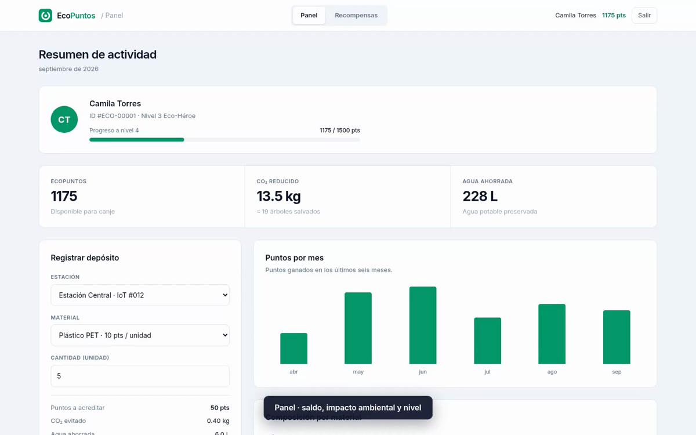

# EcoPuntos

App de reciclaje con recompensas. Deposita material en un contenedor inteligente,
acumula EcoPuntos y canjéalos en comercios aliados.

Stack: **Next.js (App Router) · TypeScript · Tailwind v4 · SQLite**.

## Demo

[](docs/demo.mp4)

*~1 min: acceso, panel, depósito con cálculo en vivo, canje con código, registro
con validación y la misma app en móvil.*

## Requisitos

Solo **Node.js 24 o superior**. No hace falta base de datos externa, Docker ni
herramientas de compilación: SQLite viene dentro de Node (`node:sqlite`) y las
contraseñas se cifran con `node:crypto` (scrypt). No hay módulos nativos.

Dependencias de runtime: `next`, `react`, `react-dom`. Nada más.

## Arrancar

```bash
npm install
npm run dev          # http://localhost:3000
```

Producción:

```bash
npm run build
npm start
```

En el primer arranque se crea `data/ecopuntos.db` y se siembra solo: catálogo de
materiales, recompensas y una cuenta demo.

**Cuenta demo:** `demo@ecopuntos.app` / `demo1234`

## Estructura

```
src/
  app/
    page.tsx            redirige a /dashboard o /login
    login/ register/     acceso
    dashboard/           saldo, progreso, depósito, gráficas, historial
    rewards/             catálogo y canje
    actions.ts           server actions (registro, acceso, depósito, canje)
  lib/
    db.ts                esquema, semilla y consultas (node:sqlite)
    auth.ts              sesiones y cookie
    password.ts          hash y verificación (scrypt)
  components/            UI (Logo, AppBar, gráficas, formularios)
scripts/
  record-demo.mjs        graba el vídeo de demo (utilidad de desarrollo)
```

## Cómo funciona el acceso

- Contraseñas con **scrypt** + sal aleatoria; nunca en texto plano.
- Sesión = token aleatorio de 32 bytes guardado en SQLite y enviado en una cookie
  **httpOnly**, `sameSite=lax`, `secure` en producción, 30 días de vigencia.
- Las server actions validan todo en el servidor: el estado del botón no es una
  frontera de confianza (el saldo se vuelve a comprobar al canjear).
- Los formularios de acceso son controlados a propósito: React resetea los campos
  no controlados tras una acción, lo que borraría lo escrito ante un error.

## Modelo de datos

`users`, `sessions`, `rewards`, `deposits`, `redemptions`.
El saldo **no se guarda**: se deriva de los movimientos (`depósitos aprobados −
canjes`), así no puede desincronizarse.

## Notas

- Los depósitos con estado `En proceso` no suman al saldo hasta aprobarse.
- Los niveles suben cada 500 puntos (Recolector → Leyenda circular).
- Variables opcionales: `ECOPUNTOS_DATA_DIR`, `ECOPUNTOS_DB`.
- El vídeo se regenera con `node scripts/record-demo.mjs` (requiere Playwright,
  que no es dependencia del proyecto para no arrastrar la descarga de un navegador).

## Pendiente para producción

Fuera del alcance de esta versión: recuperación de contraseña, verificación de
correo, límite de intentos de acceso, y `npm audit`/CSP en el despliegue.
